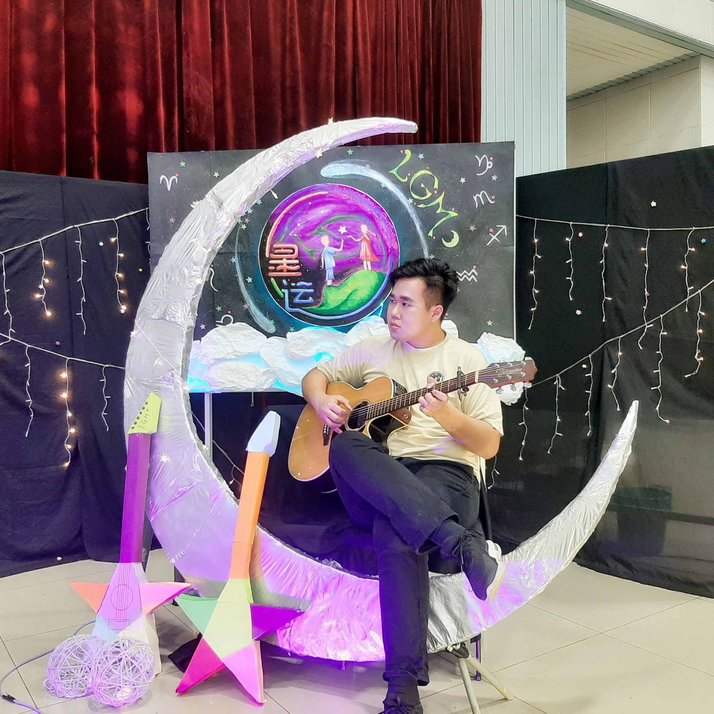

# 👋 Hi, I'm Bong Wei Khang

🎓 MSc Computer Science (Applied Computing)  
Universiti Malaya  

🎓 BSc Electrical Engineering (First Class Honours)  
Universiti Sains Malaysia  

💻 Aspiring Cloud / DevOps Engineer

---

## 🔄 Academic Transition

My academic journey started in **Electrical Engineering**, where I developed a strong foundation in systems thinking and engineering principles.

Over time, my interests shifted toward **software systems, cloud infrastructure, and DevOps practices**, which motivated me to pursue a **Master of Computer Science (Applied Computing)** at Universiti Malaya.

This transition allows me to combine **hardware-level engineering knowledge with modern software and cloud technologies**.

---

## ☁️ Interests

- Cloud Computing
- DevOps & Infrastructure Automation
- Distributed Systems
- Artificial Intelligence / Machine Learning

---

## 🛠 Tech Interests

Currently exploring technologies such as:

- Linux
- Docker
- Kubernetes
- CI/CD Pipelines
- Cloud Infrastructure
- Infrastructure as Code

---

## 🚀 Current Focus

- Learning cloud infrastructure and DevOps practices
- Building personal homelab projects
- Exploring scalable system architecture

---

## 📚 Expectations for This Course

Through the **Framework-Based Software Design and Development** course, I hope to:

- Understand how modern software frameworks support scalable application development
- Learn best practices for designing and implementing framework-based systems
- Gain hands-on experience working with real-world software development tools and repositories

---

## 🎸 Fun Fact

I play fingerstyle guitar and enjoy arranging music.  
I also did some songwriting during my degree and performed in a live band.

---

## 📷 Something That Represents Me

Besides technology, I enjoy playing **fingerstyle guitar** and arranging music.

During my undergraduate years at **Universiti Sains Malaysia Engineering Campus**, I arranged a fingerstyle cover of **“Reinvigorate (重新出发)”**, a song written by my university friends **Lim Wei Liang** and **Ng Tarng Wing** from the LitleGras Music Club.

🎥 Watch the performance:  
https://www.facebook.com/share/v/1GEpQTHYKQ/

---

⭐ Always learning and building scalable systems.
