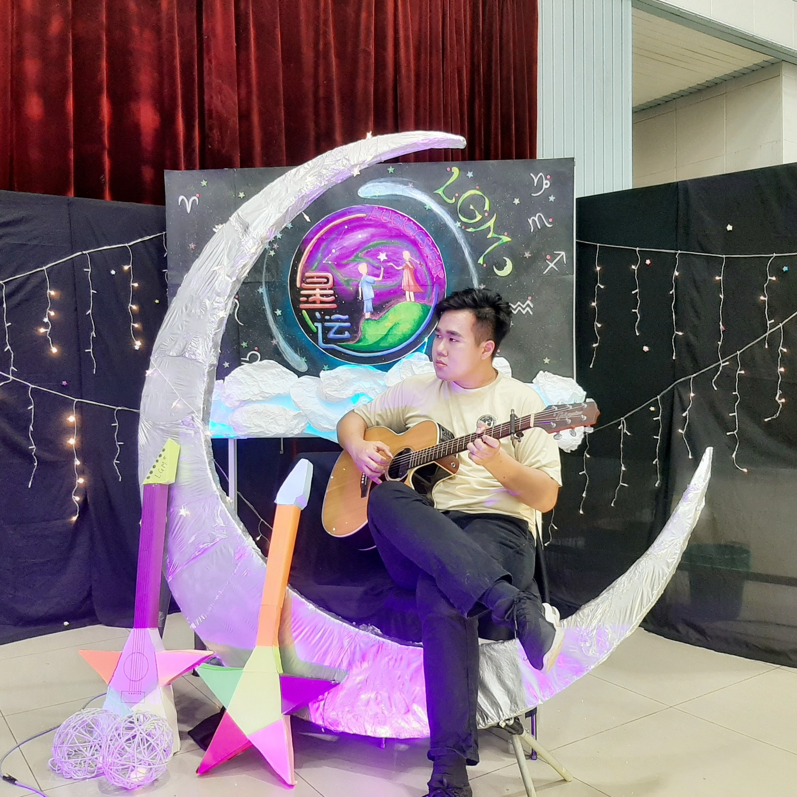

# Hi, I'm Bong Wei Khang

### Cloud Infrastructure | DevOps | Linux Operations

Engineer with production test-system troubleshooting experience at **Keysight** and prior SoC/CPU engineering experience at **Intel**. I build and operate self-hosted Linux infrastructure and develop containerized automation projects focused on reliability, repeatability, and practical operations.

I have completed the taught coursework for a **Master of Computer Science (Applied Computing)** at Universiti Malaya with a current CGPA of **4.00/4.00**; my dissertation is in progress. I also hold a **BEng (Honours) in Electrical Engineering** from Universiti Sains Malaysia with First Class Honours.

---

## Engineering Focus

- Linux infrastructure, virtualization, networking, and system operations
- AWS infrastructure and Infrastructure as Code with Terraform
- Docker-based application packaging and multi-service deployment
- CI/CD validation, automated testing, and Python/Bash/PowerShell automation
- Monitoring, recovery workflows, backup design, and failure-safe operations

## Core Technologies

| Area | Technologies |
| --- | --- |
| Cloud & IaC | AWS EC2, VPC, security groups, public/private networking, Terraform, Terraform Cloud |
| Containers & CI/CD | Docker, Docker Compose, Git, GitHub Actions, CI/CD, container health checks |
| Linux & Virtualization | Ubuntu, Debian, KVM/QEMU, libvirt/virsh, cloud-init, systemd, SSH, LVM, ZFS |
| Networking & Observability | TCP/IP, DNS, subnetting, NAT, Linux bridging and bonding, Tailscale, Zabbix, SMB/CIFS |
| Automation & Data | Python, Bash, PowerShell, PostgreSQL, SQL, SQLite, Django, REST APIs, Playwright |

---

## Featured Projects

### Self-Hosted Linux Infrastructure & Observability Homelab

Self-hosted Linux platform running **2 KVM virtual machines** and **10+ Docker workloads** for monitoring, DNS, secure remote access, storage, analytics, and automation.

- Configured a libvirt bridge over a two-NIC Linux bond in a three-interface host network
- Operate a Debian Tailscale exit-node VM and an OpenMediaVault VM with two 4 TB ZFS disks and a 200 GB staging volume
- Run Zabbix server, web frontend, MariaDB, AdGuard Home, and Dockerized Playwright/Python router-health jobs
- Protect destructive recovery actions with dry-run, reachability, confirmation, and fail-closed checks

**Stack:** Linux, KVM/QEMU, libvirt, Docker, Zabbix, Tailscale, ZFS, LVM, systemd

### [Auto Whisper Containerized AI Pipeline](https://github.com/bongwk0608/auto-whisper-docker)

Portable Docker Compose pipeline for batch speech transcription and optional speaker diarization across CPU and NVIDIA CUDA environments.

- Supports Windows, Linux, WSL2, and macOS in CPU mode, with CUDA profiles for compatible Windows/Linux hosts
- Implements resumable state, metadata/SHA-256 fingerprinting, retries, network-share recovery, local staging, and CUDA OOM fallback
- GitHub Actions runs Python compilation checks, **80 unit tests**, and CPU/CUDA Compose validation
- Used to process 31 course recordings while keeping media, transcripts, tokens, state, and model files outside Git

**Stack:** Docker Compose, Python, Bash, PowerShell, GitHub Actions, NVIDIA CUDA, OpenAI Whisper, pyannote.audio

### Self-Hosted Rental Analytics Platform — myprop-crawler

Personal self-hosted platform that converts room-listing pages into durable, queryable time-series data. The source repository is private and can be made available upon request for technical review.

- Five-service Docker Compose stack: PostgreSQL, Python/Playwright crawler, Django, Metabase, and Adminer
- Separates stable listing dimensions from daily observations and supports resumable crawls and completeness audits
- Uses a disk-backed spool to preserve and replay data after PostgreSQL outages
- Provisions a Debian 12 KVM VM with cloud-init, virsh, SSH, and rsync
- Schedules crawls, spool replay, and compressed PostgreSQL backups with systemd timers; includes a documented restore procedure, 14-day retention, and **99 automated test cases**

**Stack:** Linux, Docker Compose, PostgreSQL, Python, Playwright, Django, Metabase, KVM/QEMU, systemd

### AWS Infrastructure as Code & Docker Lab

Universiti Malaya cloud-computing project covering Infrastructure as Code, network segmentation, controlled administrative access, and containerized compute.

- Provisioned a 10.0.0.0/16 AWS VPC through Terraform Cloud with public/private subnets, an internet gateway, separate route tables, security groups, a public bastion, and a private EC2 node
- Kept the private node isolated from direct internet access while preserving internal VPC connectivity
- Validated two-hop SSH access through the bastion host
- Deployed containerized web workloads across five separate EC2 instances during a time-constrained assessment

**Stack:** AWS EC2, VPC, Terraform Cloud, Docker, Linux, SSH

### [EcoSync AI](https://github.com/bongwk0608/ecosync-ai) — Top 10 Finalist

Team project recognized as a **Top 10 Finalist** at the 2026 GDG Kuala Lumpur Build with AI Hackathon.

- Ranks startup-to-mentor matches with deterministic scoring and Gemini-assisted structured explanations
- Keeps humans accountable through approve, reject, and review decisions
- Containerizes a React frontend and Django REST Framework backend with Docker Compose
- Implements token-based access, admin approval, Firestore-ready persistence, AI response caching, deterministic fallback behavior, and **23 backend tests**

**Stack:** React, Django REST Framework, Python, Docker Compose, Google Gemini API, Firebase/Firestore, REST APIs

---

## Additional Projects

- [SpaceFlow Venue Booking System](https://github.com/bongwk0608/django-venue-booking) — Django booking workflow with authentication, permissions, transaction-based conflict handling, Docker Compose, and 33 tests
- [Advanced Algorithms for Scheduling, Routing, and Road Planning](https://github.com/bongwk0608/advanced-algorithms-scheduling-routing-road-planning) — Python implementations and comparative analysis of scheduling, shortest-path, routing, and spanning-tree algorithms

## Current Direction

I am pursuing Cloud Infrastructure, DevOps, and Linux Operations opportunities in Greater Kuala Lumpur. My current work focuses on deepening practical AWS, Terraform, Linux, container, CI/CD, networking, and observability skills through systems that remain in operation beyond a one-off tutorial.

## Beyond Engineering

I play fingerstyle guitar and enjoy arranging music. Engineering is how I build reliable systems; music is how I stay expressive.

